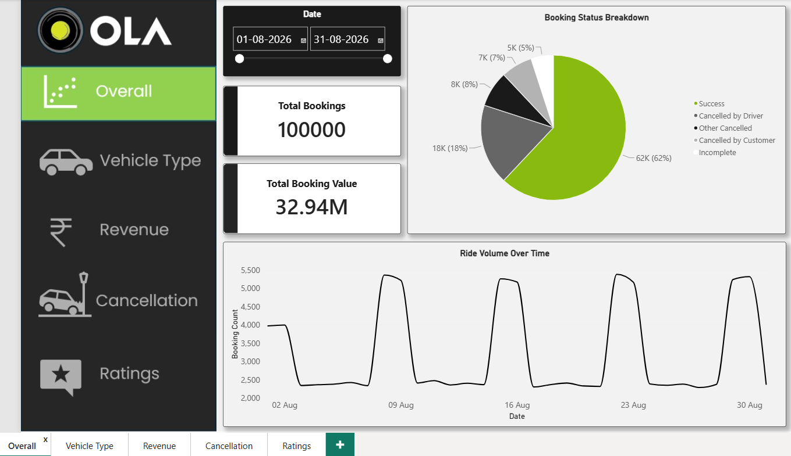

# Ola Ride Analytics Dashboard

## Project Overview
This project analyzes Ola ride booking data using Power BI.

## Tools Used
- Power BI
- Power Query
- DAX
- Excel/CSV
- SQL

## Dashboard Pages
1. Overall
2. Vehicle Type
3. Revenue
4. Cancellation
5. Ratings

## Key KPIs
- Total Bookings: 100K
- Successful Bookings: 62K
- Cancelled Bookings: 25K
- Cancellation Percentage: 25%

## Key Insights
1. Ride Volume Over Time
2. Booking Status Breakdown
3. Top 5 Vehicle Types by Ride Distance
4. Average Customer Ratings by Vehicle Type
5. cancelled Rides Reasons
6. Revenue by Payment Method
7. Top 5 Customers by Total Booking Value
8. Ride Distance Distribution Per Day
9. Driver Ratings Distribution
10. Customer vs. Driver Ratings

## Files
- Ola_Dashboard.pbix — Power BI dashboard
- Ola_Delhi_booking_data.xlsx — Dataset used for analysis
## Dashboard Preview

